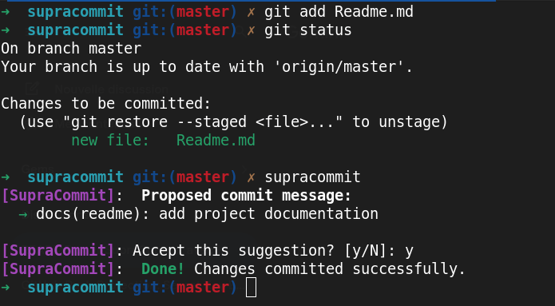

# 🚀 SupraCommit

**SupraCommit** is a powerful AI-driven CLI tool designed to analyze your `git` staged changes and generate meaningful, structured, and professional commit messages. No more generic "update" messages—let AI document your progress with precision.



---

## ✨ Features

* **Smart Context Analysis**: Automatically parses your staged changes to understand your code.
* **Format Flexibility**: Supports multiple commit standards (Conventional, Gitmoji, etc.).
* **Custom Instructions**: Direct the AI by providing specific hints using the `--` flag.
* **Highly Configurable**: Easily switch between providers and models.

---

## 🚀 Usage

### Standard Generation
```bash
git add .
supracommit
```

### Using specific instructions
```bash
supracommit -- "i have add a new feature for print hello world with --hello"
```
## 🤖 Supported Models & Providers

SupraCommit is compatible with the leading AI providers:

| Supported Models | Provider |
| ----------------- | ----------- |
| Gemini            | Google      |
| OpenAI            | OpenAI      |
| Mistral           | Mistral     |
| AIGlm             | Zhipu-AI    |

---

## ⚙️ Configuration

You can customize your experience in the config file. Run `supracommit --config` to edit your settings:

```yaml
# Example Configuration
api_key: YOUR_API_KEY
model: gemini-3.1-flash-lite-preview
format: conventional_commits
```

### Supported Commit Formats

| Format | Structure | Example |
| :--- | :--- | :--- |
| **Conventional** | `<type>(<scope>): <desc>` | `fix(api): fix bug` |
| **Gitmoji** | `<emoji> <desc>` | `🐛 fix api bug` |
| **Atom** | `[<type>] <desc>` | `[fix] fix api bug` |
| **Karma** | `<type>(<scope>): <subj>` | `fix(api): fix bug` |
| **50/72** | `Capitalized (50 char max)` | `Fix bug in API` |
